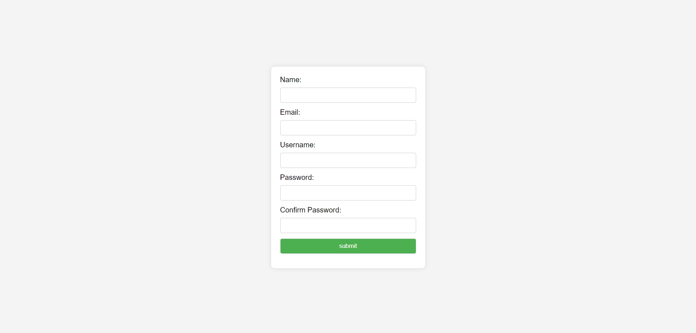

# Minima laptop store
## Participants
- Abylai Taitoleuov 🤖
- Asainov Damir 🏆

## Brief Project Description
This Go application demonstrates basic CRUD (Create, Read, Update, Delete) operations using MongoDB. It includes a simple web server with endpoints for displaying a form, submitting data, and storing the submitted data in a MongoDB database.


## Screenshot


## Step-by-Step Instructions for Launching the Application
1. **Clone the Repository:**
   ```
   git clone https://github.com/nek07/golang-assignment-2.git
   ```

2. **Navigate to Project Directory:**
   ```
   cd golang-assignment-2
   ```

3. **Start the Server:**
   ```
   go run main.go
   ```

6. **Access the Application:**
   Open your web browser and go to `http://localhost:8080`

## Tools Used
- **Frontend:**
  - HTML
  - CSS

- **Backend:**
  - GO
  
- **Go Modules**
  - `go.mongodb.org/mongo-driver` for MongoDB interactions
  - `github.com/joho/godotenv/autoload` for loading environment variables
  - `github.com/eminetto/mongo-migrate` for database migrations

- **Database:**
  - MongoDB

- **Version Control:**
  - Git

- **Development Environment:**
  - Visual Studio Code

**Links to Sources:**
- [Mongo Driver](https://pkg.go.dev/go.mongodb.org/mongo-driver)
- [Mongo Migrate](https://github.com/eminetto/mongo-migrate)
